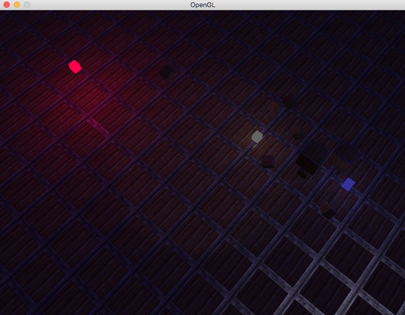
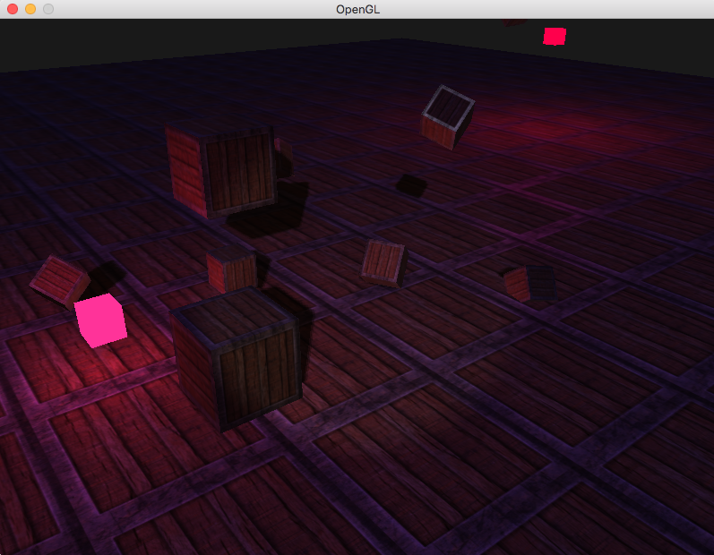
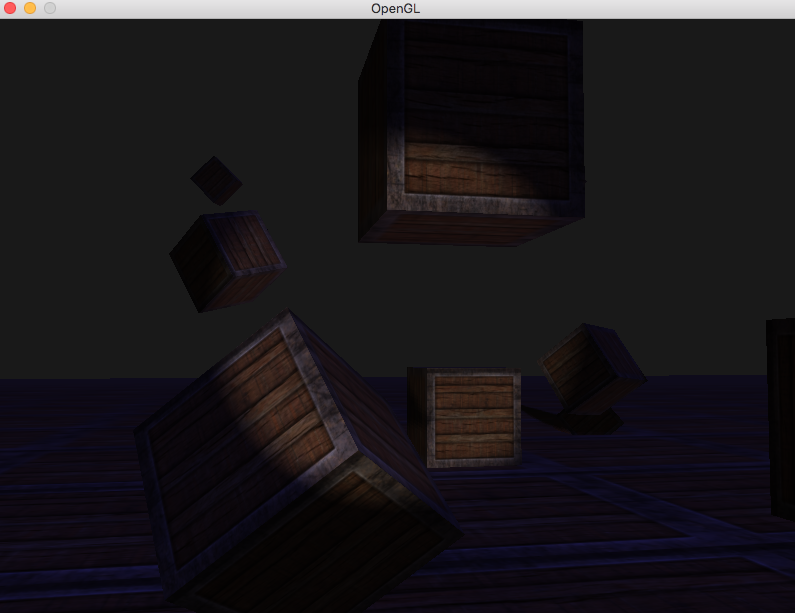
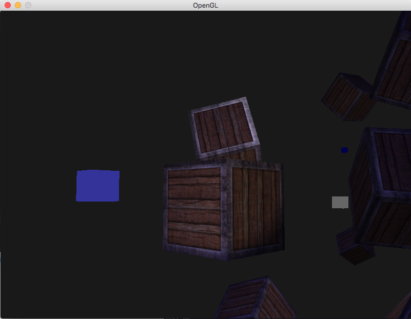

# OpenGLGame

This project demonstrate simple examples working with 3D graphics on C++ (OpenGL calls only and GLSL Shaders): Phong Lighting, Light sources (Directional Light, Point lights, Spotlight), Multiple lights, Shadow Map, Normal Map.

# Screenshots

**Specular**

**ShadowMap, Directional Light, Point lights**

**Spotlight**

**-**

